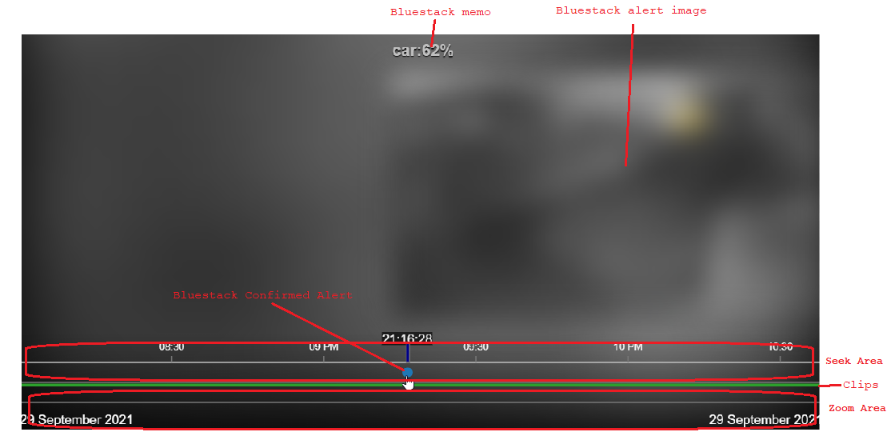

# UI3 with Timeline PoC
Proof of concept for timeline. The timeline component is based on [EventDrops](https://github.com/marmelab/EventDrops) fork: [Timeline](https://github.com/s-pw/EventDrops)
This is a quickly scripted PoC, I'm not planning to support it, feel free to adopt it.

It was created to fix following problems in UI3:
* when clip is very long e.g. 24h seeking is very inaccurate where few pixels can seek by minutes making it useless for viewing short events
* when clips are shorter it is impossible to view timelapse using seek for long events e.g. how was snow melting during the day or how garden changed over months/seasons
* searching confirmed events is hard, you can't easily tell which events occurred over short period of time

## Demo

## Usage

There are 2 main areas:
1. Seek Area - click and drag to preview across all clips and play the clip when you stop dragging
2. Zoom Area - use mouse wheel or touch gesture to zoom in/out and drag to move timeline

Seek Area also shows confirmed event as dots (hoover over the dot will show Deepstack memo and image in a tooltip)
Confirmed alerts are colored using Deepstack memo:
* green - person
* blue - car/truck
* gray - other

Between areas there are colored bars that show clips (hoover over the line to show preview and name in a tooltip):
* green - New
* yellow - Stored

## Requirements:
* it was tested with continuously recorded clips with Deepstack, it also requires clip categories named `New` and `Stored`, it might not work with other configurations
* `Show Cameras in Group Dropdowns` has to be enabled in UI3 setting and single camera selected

## Known problems:
* random bugs when switching between tabs
* timeline sometimes not loading
* no error handling
* H.264 player will reset timeline on playback start (use JPEG stream instead)
* the tooltip on events doesn't work well on touch devices (not implemented as it is slightly harder than just using mouseover event)
* works correctly with single camera only
* seek indicator isn't updated as video plays (can be fixed with `chart.marker.updateMarker(date);`)

---

# UI3
UI3 is a powerful, modern HTML5 web interface for Blue Iris.  As of April 20, 2018, UI3 is Blue Iris's default web interface for non-IE browsers and is included with Blue Iris versions 4.7.3 and newer.

## Discuss on ipcamtalk

UI3 has a dedicated thread on the **ipcamtalk** forum, here:

https://ipcamtalk.com/threads/blue-iris-ui3.23528/

## Manual installation

If you wish to manually install UI3 (maybe to get a bugfix without waiting for it to arrive in a Blue Iris update), you can get it from the releases tab: https://github.com/s-pw/ui3/releases

To install, just extract everything to Blue Iris's `www` directory and overwrite all files.  The default path to this folder is `C:\Program Files\Blue Iris 5\www`.

### Blue Iris 4.x Users

Blue Iris 4.8.6.3 shipped with [UI3-70](https://github.com/bp2008/ui3/releases/tag/70), but you can update to [UI3-77](https://github.com/bp2008/ui3/releases/tag/77) for a few improvements.  Things will begin breaking if you update a Blue Iris 4.x installation beyond UI3-77.
